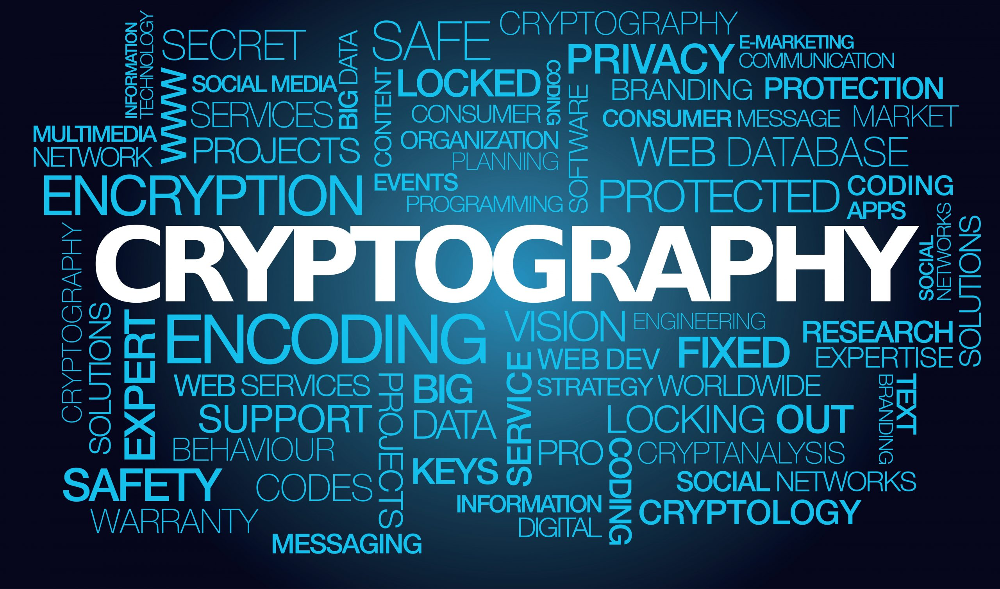

[Source of Image](https://www.google.com/url?sa=i&url=https%3A%2F%2Fwww.sslcertificate.ch%2Fpost-quantum-cryptography%2F&psig=AOvVaw0NXacyHaKHoFUZ7ejdirW0&ust=1603620140344000&source=images&cd=vfe&ved=0CAIQjRxqFwoTCKirv-L8zOwCFQAAAAAdAAAAABAD)
# RSA-Encryption
:sparkles::fireworks::tada: Important points about this Repository!!!!! :tada::fireworks::sparkles:
* This Repository contains the code of RSA Encryption which is a topic in Cryptography.
* RSA is a widely adopted encryption technique!
* Code of RSA Encryption Technique will be present in the corresponding folder with the langauge name in the Repository!

# Few Details about the RSA Encryption Algorithm!
* It is developed by Ron Rivest, Adi Shamir, & Leonard Adleman in 1977.
* Initials of the surnames of each of the developers of the RSA algorithm were used for the name of the algorithm!
* It is an asymmetric algorithm as 2 keys (public & private) are used in this algorithm!
* It is a Block Cipher Algorithm.
* Plain Text & Cipher Text are Integers between 0 & (n - 1) for some value of n(calculated in the algorithm).  

